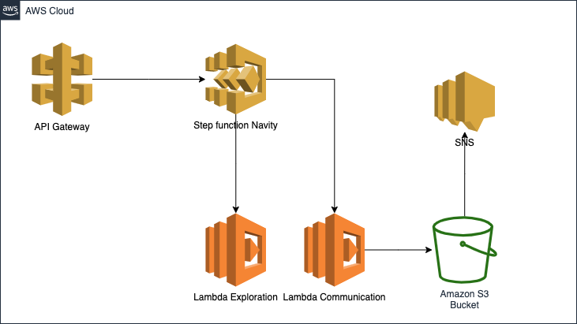
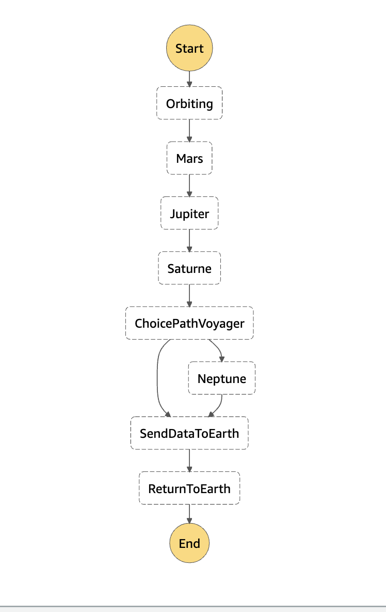

# Spacity project  

Design and create a serverless architecture using aws managed services.

## The story behind this demo

`Spacity` is an agency specialized in space exploration launch a program named `Navity`. The latter has an objectif to explore and collect data of planets Mars, Jupiter, Satrune and Neptune and then send data back to earth. 
The agency has developed two spacecrafts for this program ( `voyager1` and `voyager2`). The spacecraft `voyager1` has a bigger solar panels than `voyager2` so it can reachs the planet Neptune. `voyager2` returns to earth after visting Saturne. 
Each spacecraft should send collected data to earth before starting the return trip.  

## Which aws services to use 

To implements the `Navity` program, we will be using the following aws services 

- S3 Bucket `spacity-agency` in which we will recieve data from spacecrafts.
- Lambda Function `exploration` to collect data of a specific planet.
- Lambda Function `communication` to send data to earth ( send resulted json to the s3 bucket )
- StepFunction state machine `navity` to orchestrate the mission. It acceptes the spacecraft type as input (  `{"spacecraft": "voyager1"}`)
- API Gateway to launch trigger the step function and launch the spacecraft. 
- SNS notification service with a topic `spacity` and an email subscription
  - Once a file is uploaded to the s3 bucket, an event is created in the topic and an email is sent to mission's responsible. 
- IAM roles for services permissions

### Architecture



### State machine 



## How to create the stack

Create a new aws cloudformation stack using the template `stack-spacity.yaml`. Wait a couple of minutes and all resources should be created. 

## How to test

Select the API Gateway `spacity` and then under resource `POST missions`  click Test button. In the following body 

```json
{
   "input": "{\"spacecraft\" : \"voyager2\"}",
   "name": "MyExecution",
   "stateMachineArn": "arn.of.your.created.stepfunction"
}
```

## Results 

The api gateway will trigger the state machine. Depends on the spacecraft, the state machine will execute the right scenario and send a json file to the s3 bucket under `spacity-agency/missions/navity/voyager2/timestamp.json`. Once the file is deposed, s3 create an event in sns topic `spacity`. The subscription send an email to inform you the success of the mission.  