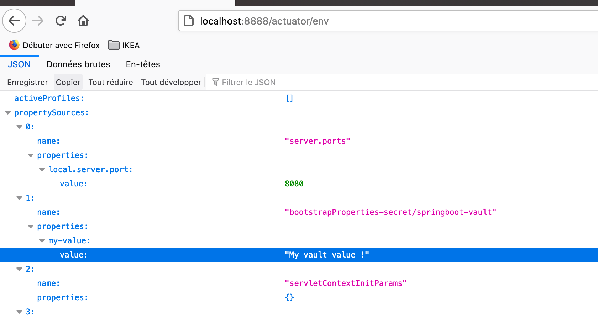

# HashiCorp Vault - AppRole

Source code for the Hashicorp Vault integration with spring boot using AppRole Authentication method.

## Prerequisites

- Kind
- Docker

## Goals

In this demo we will install `hashicorp vault` and configure appRole authentication to enable a spring boot application to connect at bootstrap and fetch secrets. We will be using a dummy-project which is a simple spring boot application.

### Demo application

[Springboot-vault](https://github.com/bdridi/springboot-vault)

## Installation

- Run `zsh kind.sh`  from the root folder

- Wait a couple of minutes and your cluster will be up and ready.

## Configure Vault

### Vault access

We can access to vault through both console and the user interface.

#### Connect to Vault UI

##### Create a token

execute the following command `kubectl exec -ti vault-0 -- vault token create`, you should see the token displayed as follows :

```
Key                  Value
---                  -----
token                s.9QL1Pf1Zud7wqWIGjzKLXZCH
token_accessor       aC7Wb5CL9t0sMPLiyEGycRMm
token_duration       ∞
token_renewable      false
token_policies       ["root"]
identity_policies    []
policies             ["root"]
```

##### Port forward vault pod 

`kubectl port-forward vault-0 8200:8200`

##### Access vault ui 

visit `localhost:8200/ui` and use the token method to authenticated using the generated token.

#### Access vault with console

We can access to the pod's shell and execute all vault commands.

`kubectl exec -it vault-0 /bin/sh`

### Activate AppRole authentication method

`vault auth enable approle`

### Activate kv secrets engine

`vault secrets enable -version=2 kv`

### Create a policy

We need to give our application a read only access to all secrets under the path **secret/data/springboot-vault/** 

```
vault policy write springboot-vault - <<EOF
  path "secret/data/springboot-vault*" {
      capabilities = ["read", "list"]
  }
  EOF
```

### Create an appRole for the application

The appRole **springboot-vault** with  the policy **springboot-vault** attached. 

`vault write auth/approle/role/springboot-vault token_policies="springboot-vault"`

### Create secrets

`vault kv put secret/springboot-vault my-secret='My vault secret !'`

`vault kv put secret/springboot-vault my-value='My vault value !'`

### Retrieve AppRole credentials 

The spring boot application needs the couple `role-id`, `secret-id` to be able to connect to vault at bootstrap.

- role-id :
`vault read auth/approle/role/springboot-vault/role-id`

- secret-id :
`vault write -force auth/approle/role/springboot-vault/secret-id`

### Create a kubernetes secret

The vault credentials need to be stored in a kubernetes secrets and mapped into environments variables.

- Encode the role-id, secret-id and vault address to base64 and update the secret manifest under `infra/secret.yaml`. 

```yaml
apiVersion: v1
data:
  VAULT_ADDRESS: encodedBase64(vault-service)
  VAULT_ROLE_ID: encodedBase64(role-id)
  VAULT_SECRET_ID: encodedBase64(secret-id)
kind: Secret
metadata:
  creationTimestamp: '2021-02-16T16:56:24Z'
  name: springboot-vault-secret
  namespace: default
  resourceVersion: '112565877'
  selfLink: /api/v1/namespaces/default/secrets/springboot-vault-secret
  uid: e7329b29-7077-11eb-bd50-005056b6d767
type: Opaque
```

- create the secret `kubectl apply -f infra/secret.yaml`

## Deploy the application

`kubectl apply -f app/application.yaml`

### Viewing Secrets

Now we can check if our application has been logged to vault and successfly retrieved the secrets.

- Port forward the pod on port 8888

`kubeclt port-forward svc/springboot-vault-service 8888:8080`

- Display spring boot loaded application properties under `localhost:8888/actuator/env`, you should see the secret `my-value` as the following screenshot
  


## Versions

This tutorial is designed to run entirely in Kubernetes and has been tested with the following development environment and component versions.

- macOS Catalina v10.15.7
- go go1.15.5
- kubectl client v1.16.6-beta.0
- kubectl server v1.19.1
- kind v0.8.1
- helm v3.3.1
- kind v0.9.0
- vault 0.6.0
- consul 0.23.1