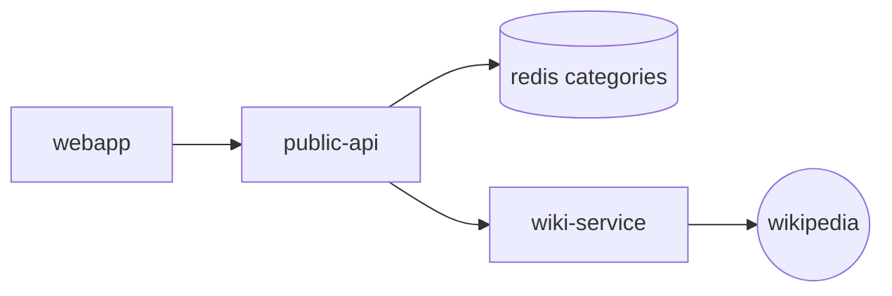

# Monitoring - Prometheuse and Grafana

Source code for the Kubernetes Observability demo using the Microlearning demo app.

## Goals

In this demo we will set up basic observability using the hyper efficient and famous tools Prometheuse for metric collecting and Grafana for visualising data in beautiful dashboards. We will be using the microlearning project as a demo.

## Demo project: Microlearning

### Overview

Microlearning is demo project for training purpose. The idea is to display a list of random wiki pages to the user based on a set of categories stored in a redis database.

### Microservices

- [Microlearning-api](https://github.com/bdridi/microlearning-api)
  - the public api  
- Microlearning redis 
  - the database to store categories
- [Microlearning web application](https://github.com/bdridi/microlearning-webapp)
- [Microlearning-wiki service](https://github.com/bdridi/microlearning-wiki)
  - search on wikipedia a random pages with specific category. 

### Architecture


## Installation

- Run `zsh kind.sh`  from the root folder

- Wait for a couple of minutes and your cluster will be ready.
  
- The ingress controller might takes a little bit more time before it becomes up and running. Wait until is ready to process requests running

```shell
kubectl wait --namespace ingress-nginx \
  --for=condition=ready pod \
  --selector=app.kubernetes.io/component=controller \
  --timeout=120s
```

- Setup hosts :
Since we work locally, kind is configured to make the ingress controller reachable over localhost. So we need to configure our hosts file to be able to use our custom domain names.

  - add the follwing entries to your `/etc/hosts` file :

  ```shell
  127.0.0.1 api.microlearning.workcale.io
  127.0.0.1 microlearning.workcale.io
  ```

- Run `watch kubectl get pods` so that you can monitor when all the pods are up and running

## Viewing the app

- Add a set of categories :

  `curl --location --request POST 'api.microlearning.workcale.io/api/v1/microlearning/categories?name=kubernetes'`

- Open `microlearning.workcale.io` in a browser and you should see the app UI running and serving wiki pages about kubernetes

## Monitoring

We will be monitoring the public api ( microlearning-api ). Since the microservice is a spring boot application we use `micrometers` library to export prometheus metrics through the url `/actuator/prometheus`.

#### Access Grafana

1\. port-forward grafana service

`export POD_NAME=$(kubectl get pods --namespace default -l "app.kubernetes.io/name=grafana,app.kubernetes.io/instance=grafana" -o jsonpath="{.items[0].metadata.name}")`

`kubectl --namespace default port-forward $POD_NAME 3000`

2\. Login to Grafana `localhost:3000` with the following credentials `admin:password`
3\. Import json dashboards under `/dashboards/`

#### Import the Grafana dashboards

- JVM (Micrometer) : A downloaded dashboard for jvm monitoring of spring boot application from `https://grafana.com/grafana/dashboards/4701`
- Custom dashboard : A custom dashboard that contains 3 panels to display requests rate per second by uri
- Node exporter dahsbord for cluster metrics downloaded from `https://grafana.com/api/dashboards/1860/revisions/14/download`

### Traffic generator

In order to simulate traffic please run the traffic generator script `bash traffic-generator.sh`. Now go to Grafana web interface and you should see the evolution of the panel `2XX Requests` ( rate requests per second / enpoint ) . 

### Alerting

- We can set threshold on a particular graph and be notified if we reach it. In the `2XX Requests` we have defined a low test threshold rate `3` per second. You can see the horizontal bar in the graph.
- Eventually we can send notification throught multiple communication channels like email, slack, ect. This could be done by configuring a notification channel and select the desired alert.

## Versions

This tutorial is designed to run entirely in Kubernetes and has been tested with the following development environment and component versions.

- macOS Catalina v10.15.7
- go go1.15.5
- kubectl client v1.16.6-beta.0
- kubectl server v1.19.1
- kind v0.8.1
- helm v3.3.1
- kind v0.9.0