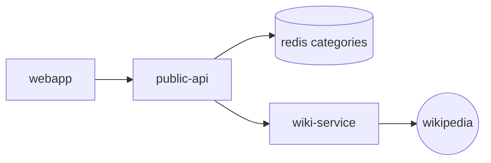
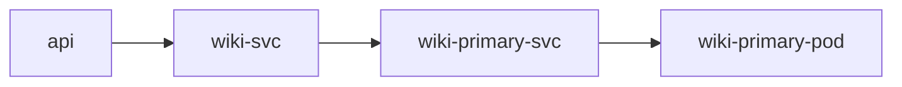
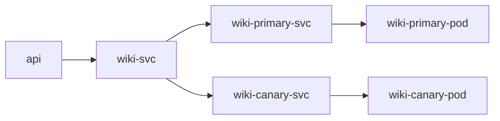

# Service mesh - Linkerd

Source code for the Kubernetes service mesh Linkerd demo using the Microlearning demo app.

## Prerequisites

- linkerd CLI 
- Mermaid
- Kind 
- Docker

## Goals

In this demo we will set up `Linkerd` service mesh. We will be using the microlearning project as a demo.
Automatic mTLS. Linkerd automatically enables mutual Transport Layer Security (TLS) for all communication between meshed applications.

## Demo project: Microlearning

### Overview

Microlearning is demo project for training purpose. The idea is to display a list of random wiki pages to the user based on a set of categories stored in a redis database.

### Microservices

- [Microlearning-api](https://github.com/bdridi/microlearning-api)
  - the public api  
- Microlearning redis 
  - the database to store categories
- [Microlearning web application](https://github.com/bdridi/microlearning-webapp)
- [Microlearning-wiki service](https://github.com/bdridi/microlearning-wiki)
  - search on wikipedia a random pages with specific category. 

### Architecture



## Installation

- Run `zsh kind.sh`  from the root folder

- Go make a coffee and come back in about 10 minutes on a macbook pro with 16 GB of RAM.
- The ingress controller might takes a little bit more time before it becomes up and running. Wait until is ready to process requests running

```shell
kubectl wait --namespace ingress-nginx \
  --for=condition=ready pod \
  --selector=app.kubernetes.io/component=controller \
  --timeout=120s
```

- The kind.sh script install linkerd and activate the mesh for services `wiki`, `api` and `webapp`. It install also Flagger for canary rollout releases.  

- Setup hosts :
Since we work locally, kind is configured to make the ingress controller reachable over localhost. So we need to configure our hosts file to be able to use our custom domain names.

  - add the follwing entries to your `/etc/hosts` file :

  ```shell
  127.0.0.1 api.microlearning.workcale.io
  127.0.0.1 microlearning.workcale.io
  ```

- Run `watch kubectl get pods` so that you can monitor when all the pods are up and running

- Run `linkerd check` to check the status of linkerd installation.

## Viewing the app

- Add a set of categories :

  `curl --location --request POST 'api.microlearning.workcale.io/api/v1/microlearning/categories?name=kubernetes'`

- Open `microlearning.workcale.io` in a browser and you should see the app UI running and serving wiki pages about kubernetes

## Service mesh

With the control plane installed and running, you can now view the Linkerd dashboard by running `linkerd dashboard &`

### Monitoring 

Linkerd automatically collects metrics from all services that send traffic through it.
It provides alos a set of grafana dashboards that are available for all meshed services.

### TLS validation

By default, Linkerd automatically enables mutual Transport Layer Security (mTLS) for TCP traffic between meshed pods, by establishing and authenticating secure, private TLS connections between Linkerd proxies.

To check the security validation `linkerd -n linkerd edges deployment`
The output will look like :

```
SRC                  DST                      SRC_NS    DST_NS    SECURED       
linkerd-prometheus   microlearning-api        linkerd   default   √  
linkerd-prometheus   microlearning-webapp     linkerd   default   √  
linkerd-prometheus   redis                    linkerd   default   √  
```

### Canary Rollout 

To test the canary rollout let's consider that we want deploy an new version of the wiki service.

#### Configure the release

- Before doing anything we need to configure how the release should be rolled out.

`kubectl apply -f infra/canary.yaml`

Flagger will create a new primary pod for wiki service and scale down the old deployement to 0 once created. 

```
NAME             TYPE        CLUSTER-IP      EXTERNAL-IP   PORT(S)    AGE
api-service      ClusterIP   10.96.92.180    <none>        8080/TCP   130m
kubernetes       ClusterIP   10.96.0.1       <none>        443/TCP    130m
redis            ClusterIP   10.96.135.124   <none>        6379/TCP   130m
webapp-service   ClusterIP   10.96.6.155     <none>        80/TCP     130m
wiki             ClusterIP   10.96.122.97    <none>        8081/TCP   130m
wiki-canary      ClusterIP   10.96.215.28    <none>        8081/TCP   5m10s
wiki-primary     ClusterIP   10.96.20.144    <none>        8081/TCP   5m10s
```

Since we haven't applied yet any modification all traffic is redirected directly to wiki-primary service as follow .



#### Start the rollout

We need to change the spec of the wiki microservice and Flagger will automatically detects the change of state so it will kick off the rollout. 

Change the docker image `kubectl set image deployment/wiki wiki=workcale/microlearning-wiki:canary`



The rollout starts, you can see the status of the canary by executing this command `kubectl get canary`. The result will looks like follows
```
NAME   STATUS        WEIGHT   LASTTRANSITIONTIME
wiki   Progressing   0        2021-03-02T11:43:22Z
```

#### Generate traffic

To visualise the traffic split we need to generate a traffic. Run the script `load-geerator-wiki.sh` that performs 100 times curl requests on GET articles api. This will call our wiki service.

You can visualise the description of the rollout 

```
$ kubectl describe canary/wiki

  Normal   Synced  93m                flagger  Advance wiki.default canary weight 20
  Normal   Synced  93m                flagger  Advance wiki.default canary weight 30
  Normal   Synced  93m                flagger  Advance wiki.default canary weight 40
  Normal   Synced  93m                flagger  Advance wiki.default canary weight 50
  Normal   Synced  91m (x8 over 93m)  flagger  (combined from similar events): Promotion completed! Scaling down wiki.default

```

#### Rollout result

As you see in the previous output the canary rollout is finished, so the canary become the primary deployment and the old version is scaled down to 0. You can verify the spec of the current wiki-primary by executing `kubectl describe pod wiki-primary-7cdcdf8485-8msx8`. The docker image with the tag canary should be deployed.

```
Containers:
  wiki:
    Container ID:   containerd://ff8802adfbccbbfb4e8a174446c16eafc389a32966d37a9c94179161eeb56a7c
    Image:          workcale/microlearning-wiki:canary
    Image ID:       docker.io/workcale/microlearning-wiki@sha256:f5de3d89f12d8a7a0f6dd32898eba6140da30d97e9276f70a86e1a13bacbee34
    Port:           8081/TCP
```

## Versions

This tutorial is designed to run entirely in Kubernetes and has been tested with the following development environment and component versions.

- macOS Catalina v10.15.7
- go go1.15.5
- kubectl client v1.16.6-beta.0
- kubectl server v1.19.1
- kind v0.8.1
- helm v3.3.1
- kind v0.9.0
- Linkerd Client version: stable-2.9.4
- Linkerd Server version: stable-2.9.4